# **ExcelGPT 产品说明**

## **1 软件简介**

ExcelGPT是一款智能表格处理插件。从公式解释、公式生成、数据生成、数据分析、文本内容润色改写、中英文翻译到智能问答聊天助理等全套表格处理功能的辅助您降低表格处理工作的学习成本及门槛，把时间精力集中在创造价值上。

## **2 软件安装**

### **2.1软件下载**

[下载地址1](https://www.123pan.com/s/Czz1Td-glxxA.html)  [下载地址2](https://pan.baidu.com/s/1iNtgi479sWEk0ZmUoibqTQ?pwd=NewB)  

适用于Windows系统，推荐使用Win10以上系统及Office2012以上版本，WPS最新版本

苹果电脑macOS请见链接：[https://www.nbimgpt.com/Download/OfficeAI-Mac.html](https://www.nbimgpt.com/Download/OfficeAI-Mac.html "https://www.nbimgpt.com/Download/OfficeAI-Mac.html")

### **2.2软件安装**

安装前的准备工作：

(1)关闭Office、WPS相关软件；

(2)部分无管理员权限的电脑建议先临时关闭杀毒软件，安装完成后再开启。

安装步骤：

(1)下载安装包，解压；

(2)双击setup.exe安装文件，点击下一步，按默认安装即可

(3)安装完成，打开Exce、WPS即可使用

(4)开启宏，打开Excel软件->进入【文件】菜单->最下方点击【选项】按钮->【信任中心】->【信任中心设置】->【宏设置】->【启用VBA宏】->【信任对VBA工程对象模型的访问】->【确定】

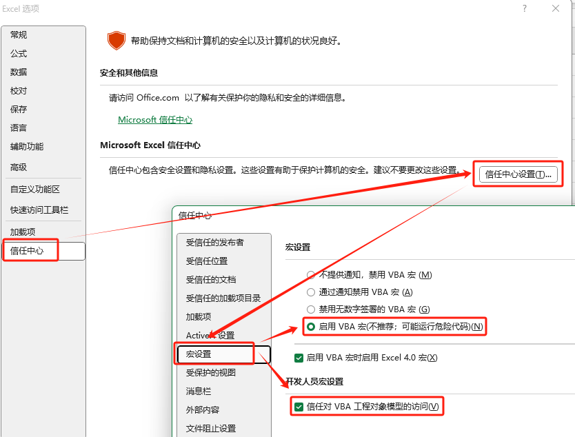

### **2.3软件升级**

点击【升级软件】按钮即可自动检查并更新到最新版本。

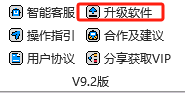

如果有新版本，等待下载完成按向导步骤执行更新安装，安装完成后重新打开Excel或WPS即可。

### **2.4软件注册与使用**（全套OfficeAI账号通用）

（1）软件注册、登录：

点击【登录】按钮，进入注册页面，使用手机号进行注册，注册后返回登录。

（2）免费版、基础版、专业版、企业版：

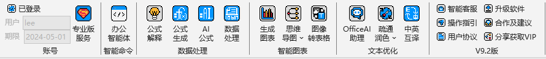

(3)企业版：企业私有化部署：详情可联系客服

(a)基础版：高质量服务优先支持专业版用户，基础版用户每天按算力情况提供限量免费高质量生成服务；

(b)专业版：所有功能均可无限次数使用及7X8小时办公解决方案客服支持，需要优惠邀请码可关注公众号:OfficeAI办公，发送：邀请码

(c)企业版：企业私有化定制部署：详情可联系客服

(d)免费版：勾选右侧面板中“免费服务”即可不限量使用轻量版服务

<table width="677"><tbody style="margin: 0px; padding: 0px; outline: 0px; max-width: 100%; box-sizing: border-box !important; overflow-wrap: break-word !important;"><tr style="margin: 0px; padding: 0px; outline: 0px; max-width: 100%; box-sizing: border-box !important; overflow-wrap: break-word !important;" class="firstRow"><td valign="top" style="margin: 0px; outline: 0px; word-break: break-all; hyphens: auto; max-width: 100%; overflow-wrap: break-word !important; box-sizing: border-box !important;"><strong style="margin: 0px; padding: 0px; outline: 0px; max-width: 100%; box-sizing: border-box !important; overflow-wrap: break-word !important;">版本对比</strong></td><td valign="top" style="margin: 0px; outline: 0px; word-break: break-all; hyphens: auto; max-width: 100%; overflow-wrap: break-word !important; box-sizing: border-box !important;"><strong style="margin: 0px; padding: 0px; outline: 0px; max-width: 100%; box-sizing: border-box !important; overflow-wrap: break-word !important;">免费版</strong></td><td valign="top" style="margin: 0px; outline: 0px; word-break: break-all; hyphens: auto; max-width: 100%; overflow-wrap: break-word !important; box-sizing: border-box !important;"><strong style="margin: 0px; padding: 0px; outline: 0px; max-width: 100%; box-sizing: border-box !important; overflow-wrap: break-word !important;">基础版</strong></td><td valign="top" style="margin: 0px; outline: 0px; word-break: break-all; hyphens: auto; max-width: 100%; overflow-wrap: break-word !important; box-sizing: border-box !important;"><strong style="margin: 0px; padding: 0px; outline: 0px; max-width: 100%; box-sizing: border-box !important; overflow-wrap: break-word !important;">专业版</strong></td><td valign="top" style="margin: 0px; outline: 0px; word-break: break-all; hyphens: auto; max-width: 100%; overflow-wrap: break-word !important; box-sizing: border-box !important;"><strong style="margin: 0px; padding: 0px; outline: 0px; max-width: 100%; box-sizing: border-box !important; overflow-wrap: break-word !important;">企业版</strong></td></tr><tr style="margin: 0px; padding: 0px; outline: 0px; max-width: 100%; box-sizing: border-box !important; overflow-wrap: break-word !important;"><td valign="top" style="margin: 0px; outline: 0px; word-break: break-all; hyphens: auto; max-width: 100%; overflow-wrap: break-word !important; box-sizing: border-box !important;">生成质量</td><td valign="top" style="margin: 0px; outline: 0px; word-break: break-all; hyphens: auto; max-width: 100%; overflow-wrap: break-word !important; box-sizing: border-box !important;">一般</td><td valign="top" style="margin: 0px; outline: 0px; word-break: break-all; hyphens: auto; max-width: 100%; overflow-wrap: break-word !important; box-sizing: border-box !important;">高</td><td valign="top" style="margin: 0px; outline: 0px; word-break: break-all; hyphens: auto; max-width: 100%; overflow-wrap: break-word !important; box-sizing: border-box !important;">高</td><td valign="top" style="margin: 0px; outline: 0px; word-break: break-all; hyphens: auto; max-width: 100%; overflow-wrap: break-word !important; box-sizing: border-box !important;">高 </td></tr><tr style="margin: 0px; padding: 0px; outline: 0px; max-width: 100%; box-sizing: border-box !important; overflow-wrap: break-word !important;"><td valign="top" style="margin: 0px; outline: 0px; word-break: break-all; hyphens: auto; max-width: 100%; overflow-wrap: break-word !important; box-sizing: border-box !important;">数据处理</td><td valign="top" style="margin: 0px; outline: 0px; word-break: break-all; hyphens: auto; max-width: 100%; overflow-wrap: break-word !important; box-sizing: border-box !important;">无限次</td><td valign="top" style="margin: 0px; outline: 0px; word-break: break-all; hyphens: auto; max-width: 100%; overflow-wrap: break-word !important; box-sizing: border-box !important;">每日限额</td><td valign="top" style="margin: 0px; outline: 0px; word-break: break-all; hyphens: auto; max-width: 100%; overflow-wrap: break-word !important; box-sizing: border-box !important;">无限次</td><td valign="top" style="margin: 0px; outline: 0px; word-break: break-all; hyphens: auto; max-width: 100%; overflow-wrap: break-word !important; box-sizing: border-box !important;">无限次</td></tr><tr style="margin: 0px; padding: 0px; outline: 0px; max-width: 100%; box-sizing: border-box !important; overflow-wrap: break-word !important;"><td valign="top" style="margin: 0px; outline: 0px; word-break: break-all; hyphens: auto; max-width: 100%; overflow-wrap: break-word !important; box-sizing: border-box !important;">OfficeAI助理</td><td valign="top" style="margin: 0px; outline: 0px; word-break: break-all; hyphens: auto; max-width: 100%; overflow-wrap: break-word !important; box-sizing: border-box !important;">永久免费</td><td valign="top" style="margin: 0px; outline: 0px; word-break: break-all; hyphens: auto; max-width: 100%; overflow-wrap: break-word !important; box-sizing: border-box !important;">永久免费</td><td valign="top" style="margin: 0px; outline: 0px; word-break: break-all; hyphens: auto; max-width: 100%; overflow-wrap: break-word !important; box-sizing: border-box !important;">永久免费</td><td valign="top" style="margin: 0px; outline: 0px; word-break: break-all; hyphens: auto; max-width: 100%; overflow-wrap: break-word !important; box-sizing: border-box !important;">永久免费</td></tr><tr style="margin: 0px; padding: 0px; outline: 0px; max-width: 100%; box-sizing: border-box !important; overflow-wrap: break-word !important;"><td valign="top" style="margin: 0px; outline: 0px; word-break: break-all; hyphens: auto; max-width: 100%; overflow-wrap: break-word !important; box-sizing: border-box !important;">办公智能体</td><td valign="top" style="margin: 0px; outline: 0px; word-break: break-all; hyphens: auto; max-width: 100%; overflow-wrap: break-word !important; box-sizing: border-box !important;">√</td><td valign="top" style="margin: 0px; outline: 0px; word-break: break-all; hyphens: auto; max-width: 100%; overflow-wrap: break-word !important; box-sizing: border-box !important;">√</td><td valign="top" style="margin: 0px; outline: 0px; word-break: break-all; hyphens: auto; max-width: 100%; overflow-wrap: break-word !important; box-sizing: border-box !important;">√</td><td valign="top" style="margin: 0px; outline: 0px; word-break: break-all; hyphens: auto; max-width: 100%; overflow-wrap: break-word !important; box-sizing: border-box !important;">√</td></tr><tr style="margin: 0px; padding: 0px; outline: 0px; max-width: 100%; box-sizing: border-box !important; overflow-wrap: break-word !important;"><td valign="top" style="margin: 0px; outline: 0px; word-break: break-all; hyphens: auto; max-width: 100%; overflow-wrap: break-word !important; box-sizing: border-box !important;">思维导图</td><td valign="top" style="margin: 0px; outline: 0px; word-break: break-all; hyphens: auto; max-width: 100%; overflow-wrap: break-word !important; box-sizing: border-box !important;">X</td><td valign="top" style="margin: 0px; outline: 0px; word-break: break-all; hyphens: auto; max-width: 100%; overflow-wrap: break-word !important; box-sizing: border-box !important;">√</td><td valign="top" style="margin: 0px; outline: 0px; word-break: break-all; hyphens: auto; max-width: 100%; overflow-wrap: break-word !important; box-sizing: border-box !important;">√</td><td valign="top" style="margin: 0px; outline: 0px; word-break: break-all; hyphens: auto; max-width: 100%; overflow-wrap: break-word !important; box-sizing: border-box !important;">√</td></tr><tr style="margin: 0px; padding: 0px; outline: 0px; max-width: 100%; box-sizing: border-box !important; overflow-wrap: break-word !important;"><td valign="top" style="margin: 0px; outline: 0px; word-break: break-all; hyphens: auto; max-width: 100%; overflow-wrap: break-word !important; box-sizing: border-box !important;">便捷功能</td><td valign="top" style="margin: 0px; outline: 0px; word-break: break-all; hyphens: auto; max-width: 100%; overflow-wrap: break-word !important; box-sizing: border-box !important;">√</td><td valign="top" style="margin: 0px; outline: 0px; word-break: break-all; hyphens: auto; max-width: 100%; overflow-wrap: break-word !important; box-sizing: border-box !important;">√</td><td valign="top" style="margin: 0px; outline: 0px; word-break: break-all; hyphens: auto; max-width: 100%; overflow-wrap: break-word !important; box-sizing: border-box !important;">√</td><td valign="top" style="margin: 0px; outline: 0px; word-break: break-all; hyphens: auto; max-width: 100%; overflow-wrap: break-word !important; box-sizing: border-box !important;">√</td></tr><tr style="margin: 0px; padding: 0px; outline: 0px; max-width: 100%; box-sizing: border-box !important; overflow-wrap: break-word !important;"><td valign="top" style="margin: 0px; outline: 0px; word-break: break-all; hyphens: auto; max-width: 100%; overflow-wrap: break-word !important; box-sizing: border-box !important;">适用人群及场景</td><td valign="top" style="margin: 0px; outline: 0px; word-break: break-all; hyphens: auto; max-width: 100%; overflow-wrap: break-word !important; box-sizing: border-box !important;">个人日常使用</td><td valign="top" style="margin: 0px; outline: 0px; word-break: break-all; hyphens: auto; max-width: 100%; overflow-wrap: break-word !important; box-sizing: border-box !important;">所有人群,科研、办公等场景</td><td valign="top" style="margin: 0px; outline: 0px; word-break: break-all; hyphens: auto; max-width: 100%; overflow-wrap: break-word !important; box-sizing: border-box !important;">所有人群,科研办公等场景</td><td valign="top" style="margin: 0px; outline: 0px; word-break: break-all; hyphens: auto; max-width: 100%; overflow-wrap: break-word !important; box-sizing: border-box !important;">超过30人的企业</td></tr><tr style="margin: 0px; padding: 0px; outline: 0px; max-width: 100%; box-sizing: border-box !important; overflow-wrap: break-word !important;"><td valign="top" style="margin: 0px; outline: 0px; word-break: break-all; hyphens: auto; max-width: 100%; overflow-wrap: break-word !important; box-sizing: border-box !important;">费用</td><td valign="top" style="margin: 0px; outline: 0px; word-break: break-all; hyphens: auto; max-width: 100%; overflow-wrap: break-word !important; box-sizing: border-box !important;">免费</td><td valign="top" style="margin: 0px; outline: 0px; word-break: break-all; hyphens: auto; max-width: 100%; overflow-wrap: break-word !important; box-sizing: border-box !important;">免费</td><td valign="top" style="margin: 0px; outline: 0px; word-break: break-all; hyphens: auto; max-width: 100%; overflow-wrap: break-word !important; box-sizing: border-box !important;">0.6-0.9元每天</td><td valign="top" style="margin: 0px; outline: 0px; word-break: break-all; hyphens: auto; max-width: 100%; overflow-wrap: break-word !important; box-sizing: border-box !important;">根据需求定制</td></tr></tbody></table>

注：如使用期限未同步更新，可关闭Excel/WPS后重新打开

## **3 软件使用**

**3.1公式解释**

自动解析当前选定单元格中的公式的函数用途和运算步骤，辅助您更容易看懂公式。如果公式有误会自动帮你检查提示错误并给出正确公式的建议，并且将结果备注在单元格中，以便后续查阅。

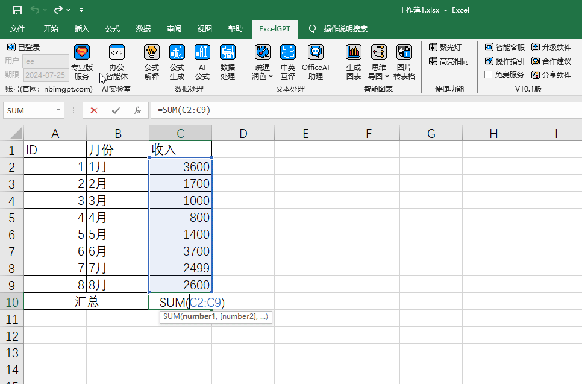

**3.2公式生成**

自动根据问题或需求描述，在当前选中的单元格中生成公式。

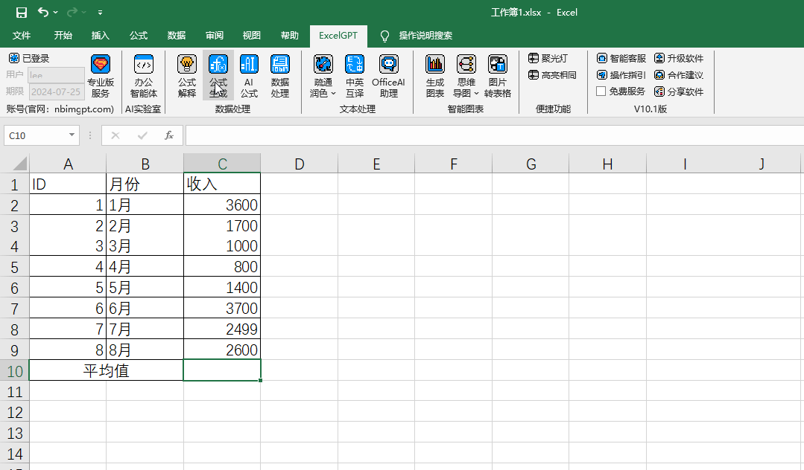

**3.3数据处理**

根据需求描述对数据进行生成或编辑的处理。

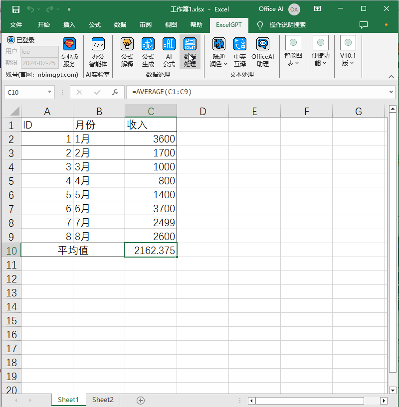

**3.4生成图表**

自动识别数据的关联关系，将选中的数据生成指定的图表形式。

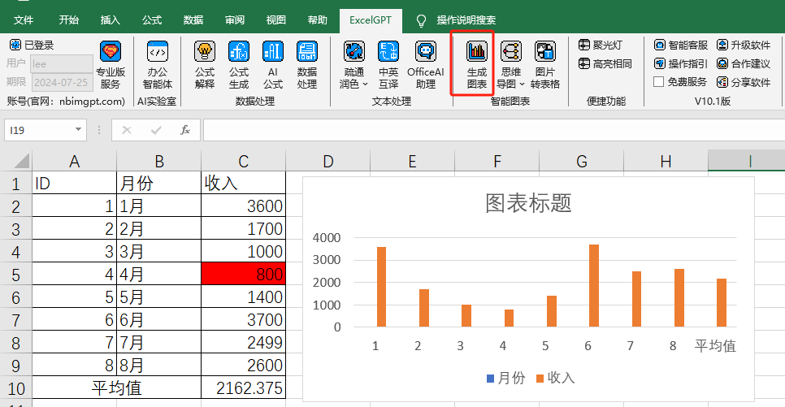

**3.5思维导图（仅支Excel，WPS表格暂不支持）**

根据选定的单元格内容生成横向或纵向的思维导图。

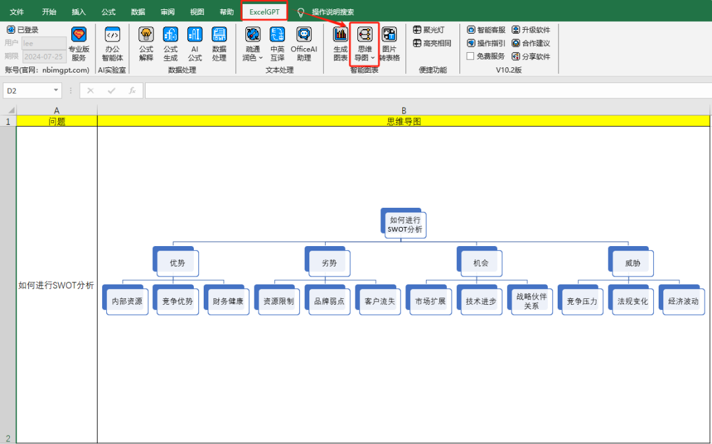

**3.6疏通润色**

选择需要改写润色的单元格，点击【疏通润色】功能，会自动改写润色当前单元格文本内容。

**3.7中英互译**

将选中单元格中的内容进行中英文转换。

**3.8OfficeAI助理**

OfficeAI助理是一个完全免费的智能对话机器人，擅长通过自然语言连续对话的形式处理解决文本及数据，如知识问答、语言翻译、生成各类文案、总结摘要、生成测试数据、数据分析等。遇到原生Excel或Wps的功能不会使用，可以直接向助理提问，需要处理的数据表格可以粘贴进助理今天界面发送指令让助理处理。

OfficeAI助理会自动登录当前插件登录的账号，如遇到无法登录的情况，可手动进行登录。

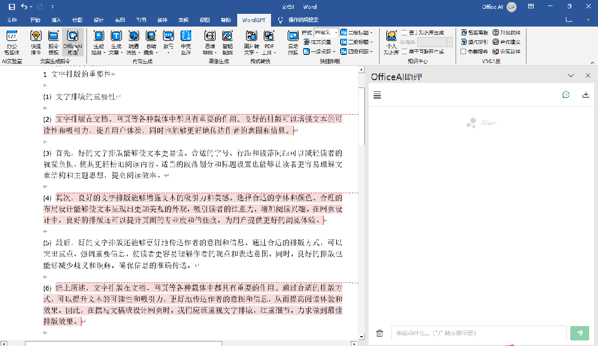

**3.9便捷功能**

（1）聚光灯：定位当前单元格的行列

（2）高亮相同：高亮相同单元格

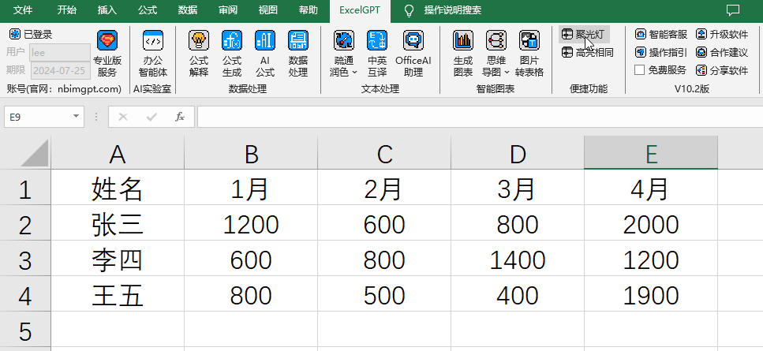

**3.10办公智能体**

办公智能体是一个适配各种工作场景的任务智能调度多模态智能体，可以检索文件、生成各种图表、思维导图、图片及知识图谱，还能辅助编辑文档。智能体的能力每月更新，可按2.3软件升级的指引每月更新智能体能力。

基本操作：

（1）命令行中输入/调用快捷指令

（2）输入@调用知识库

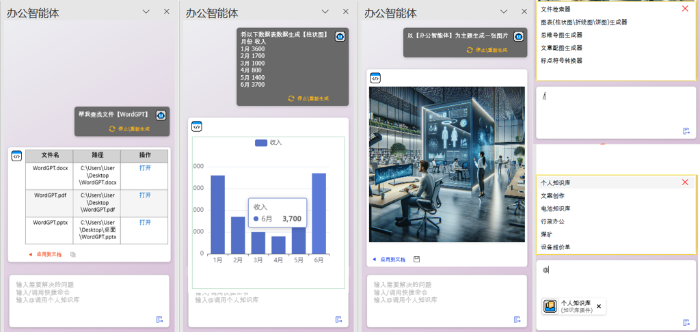

**3.11AI公式（仅支持Excel，WPS表格暂不支持）**

**（1）提问公式：AI.Ask(prompt)**

+ ***公式解释***

a.输入参数：问题内容

b.输出结果：返回对输入问题的解答

+ ***调用方式***

a.传入文本形式：=AI.Ask("如何使用Excel制作工资表")

b.传入单元格形式：=AI.Ask(A1)

+ ***操作示例***

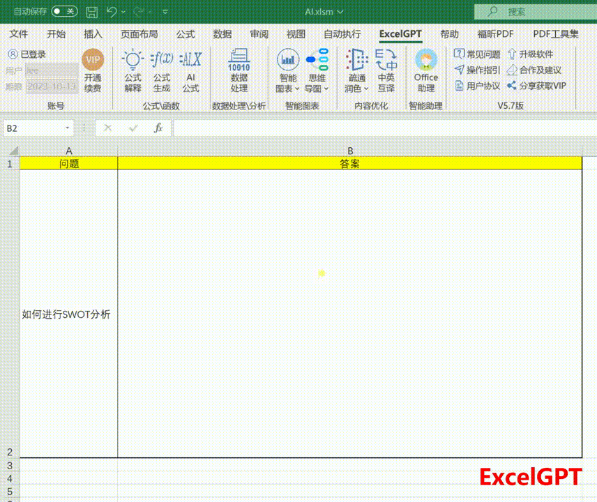

**（2）执行命令公式：****AI.Execute(content,operation)**

+ ***公式解释***

a.输入参数：第1个参数为需要处理的数据；第2个数据为对数据执行的操作

b.输出结果：返回按执行规则对数据的处理结果

+ ***调用方式***

a.传入文本形式：=AI.Execute("广东","省会")

b.传入单元格形式：=AI.Execute(A1,B1)

c.传入文本与单元格组合形式：=AI.Execute("广东",B1)或=AI.Execute(A1,"省会")

+ ***操作示例***

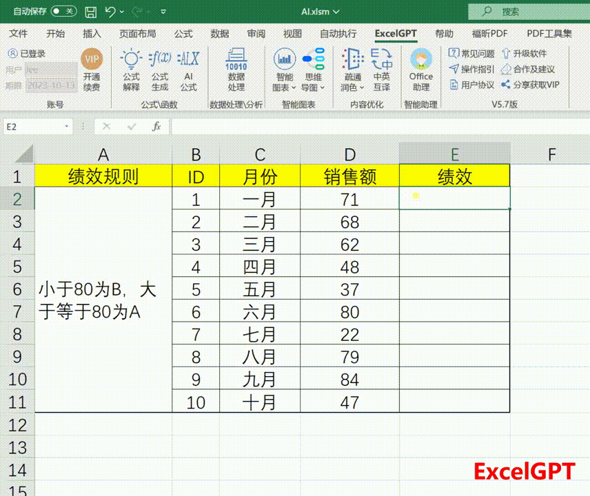

**（3）内容提取公式：AI.Extract(content,operation)**

+ ***公式解释***

a.输入参数：第1个参数为需要处理的数据；第2个数据为提取数据的规则

b.输出结果：返回按照提取规则对数据的处理结果，多个结果会以分号（;）分隔

+ ***调用方式***

a.传入问题形式：=AI.Extract("王总在珠江新城开会","提取其中的地名")

b.传入单元格形式：=AI.Extract(A1,B1)

c.传入文本与单元格组合形式：=AI.Extract(A1,"提取其中的人名")

+ ***操作示例***

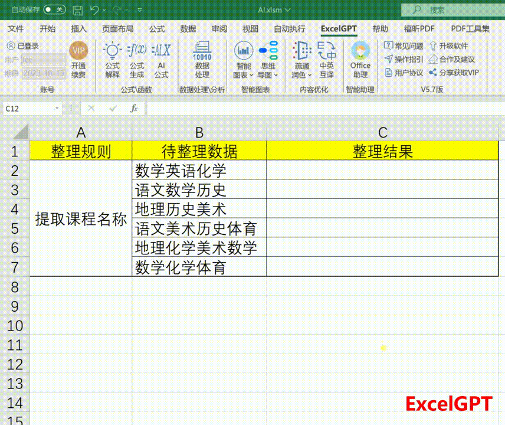

**3.13帮助**

（1）智能客服：

日常问题可7×24小时通过智能客服自助解决，如果智能客服不能解决的问题可以点击【合作建议】按钮与我们联系

（2）操作指引：

打开软件操作说明书文档

（3）合作建议：

使用过程中有任何需求或建议欢迎反馈给我们

（4）分享软件：

将ExcelGPT插件分享给您的好友
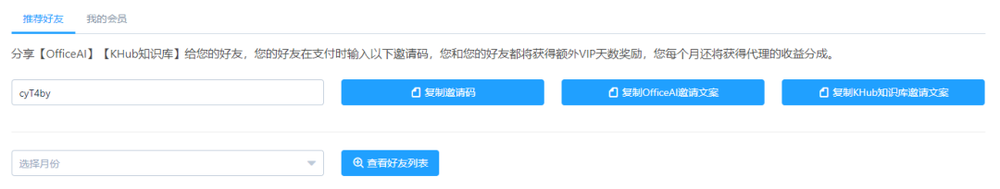

## **4 软件卸载**

**请按推荐方式进行卸载。**

可通过控制面板->卸载程序->OfficeAI办公智能体，或设置->应用->应用和功能->OfficeAI办公智能体，右键卸载。

## **5 其他问题**

**可以微信联系**

