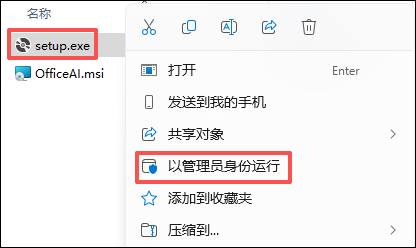
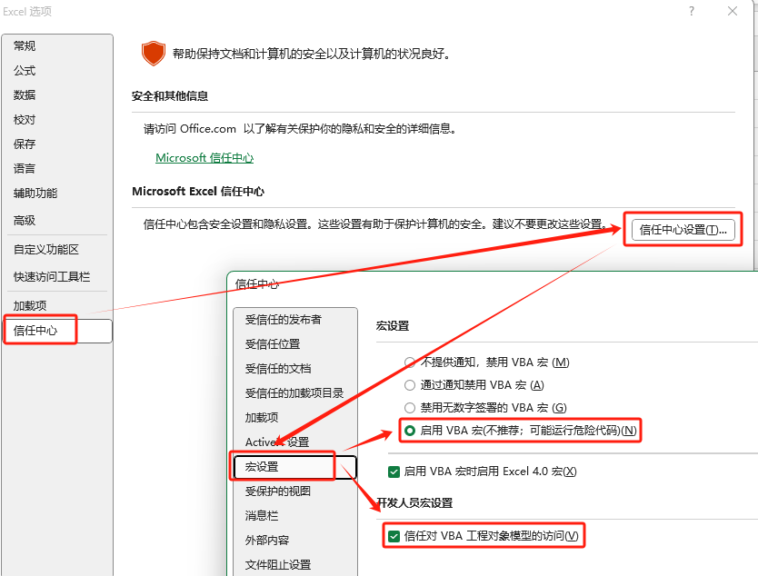
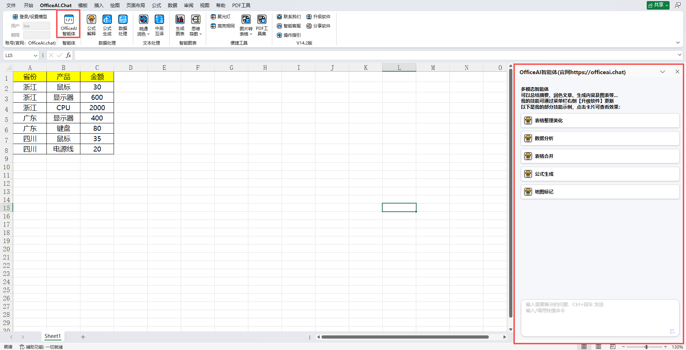
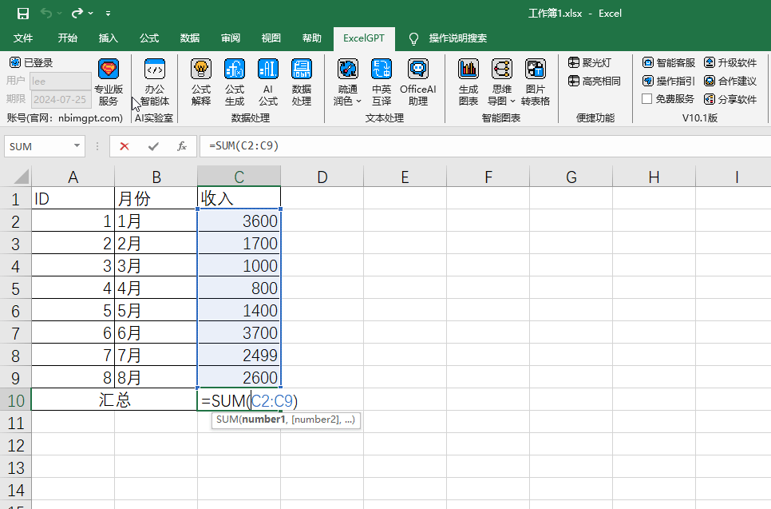
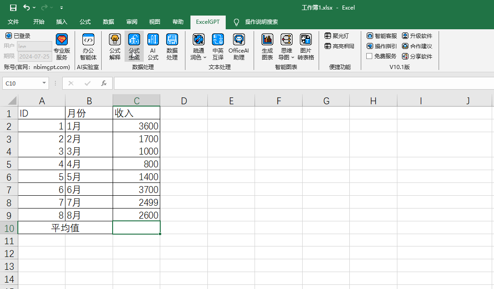
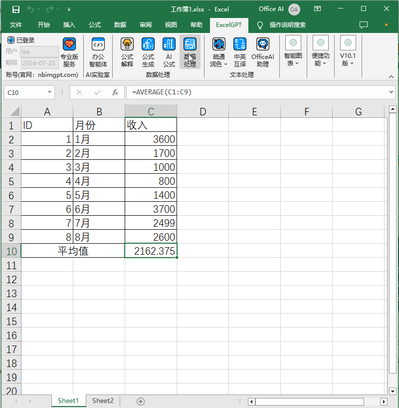
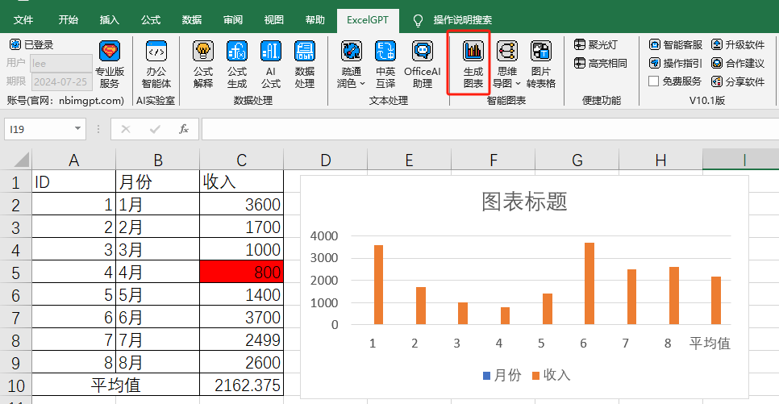
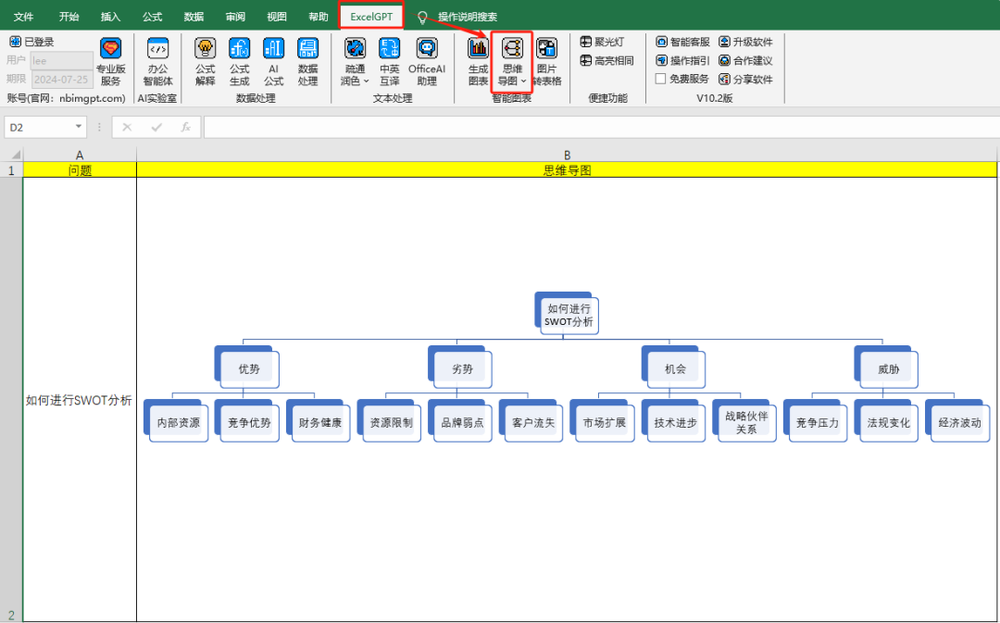
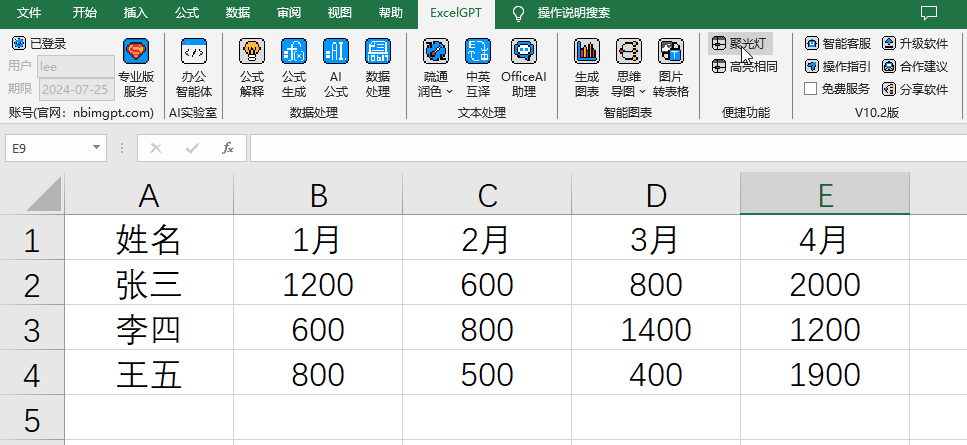

# OfficeAI.Chat

### 原ExcelGPT—一站式 AI 智能表格处理、数据分析插件

[下载软件](#-软件下载) · [功能介绍](#-软件使用) · [安装教程](#-软件安装) · [联系我们](#-联系我们)

---

## 软件简介

OfficeAI.Chat（原 ExcelGPT）是一款智能表格处理插件，覆盖公式解释与生成、数据处理与图表、文本润色改写、中英文翻译、智能问答等全套表格处理功能，降低表格工作的学习成本与门槛，让您把时间精力集中在创造价值上。

| 核心能力                 | 说明                                                                     |
| :----------------------- | :----------------------------------------------------------------------- |
| **公式解释与生成** | 自动解析公式含义与运算步骤，根据自然语言描述智能生成公式                 |
| **数据处理与图表** | 根据需求描述生成或编辑数据，自动识别数据关系生成可视化图表               |
| **文本润色与翻译** | 疏通润色单元格文本、中英文互译，提升文案质量                             |
| **OfficeAI智能体** | 多模态智能助手，支持数据处理、生成分析图/思维导图/图片、辅助编辑表格样式 |

> **适配环境：** Windows · Office 2012+ · WPS 最新版

---

## 软件安装

### 软件下载

| 下载渠道 | 链接                                                                |
| :------- | :------------------------------------------------------------------ |
| 123 云盘 | [下载地址 1](https://www.123pan.com/s/Czz1Td-glxxA.html)               |
| 百度网盘 | [下载地址 2](https://pan.baidu.com/s/1iNtgi479sWEk0ZmUoibqTQ?pwd=NewB) |

> [!IMPORTANT]
> 安装前请关闭 Office、WPS 等相关软件；部分无管理员权限的电脑建议先关闭杀毒软件，安装完成后再开启。

### 安装步骤

**第一步：安装插件**

双击或以管理员身份运行 `setup.exe`，按向导依次点击【下一步】完成安装。

**第二步：确认安装**

进入 Office（Excel / WPS 表格）后点击确认安装。

**第三步：启用 VBA 宏**

打开 Excel → 【文件】→ 【选项】→ 【信任中心】→ 【信任中心设置】→ 【宏设置】→ 勾选「启用 VBA 宏」和「信任对 VBA 工程对象模型的访问」→ 【确定】

### 软件升级

点击【升级软件】按钮即可自动检查并更新到最新版本。如有新版本，等待下载完成后按向导步骤执行更新安装，完成后重新打开 Excel 或 WPS 即可。

|              升级菜单              |              升级界面              |
| :--------------------------------: | :--------------------------------: |
|  |  |

### 登录与模型配置

#### 方式一：用户登录（目前免费）

- 勾选「登录 - 使用软件默认模型」，输入用户名和密码点击【确定】
- 新用户点击【免费注册】注册账号后登录
- 忘记密码可通过手机号重置

#### 方式二：自定义模型 API（永久免费）

勾选「免登录 - 使用自定义模型」，按以下步骤配置：

| 配置项            | 说明                                                                                        |
| :---------------- | :------------------------------------------------------------------------------------------ |
| **模型 ID** | 推荐：深度求索 DeepSeek-V4-Flash、智谱 GLM5.1、阿里 Qwen3.7-Max、OpenAI GPT-5.5（境外用户） |
| **API Key** | 进入大模型管理后台复制 API Key 并粘贴                                                       |
| **API Url** | 进入大模型管理后台复制 API Url 并粘贴（注意末尾需带 `/v1` 版本号）                        |

> [!TIP]
> 软件已预置 DeepSeek、智谱、阿里百炼等主流平台的标准地址，选择后自动填入。内网可通过 Ollama 完全离线使用，地址格式：`http://[服务器IP]:11434/v1`

---

## 软件使用

### OfficeAI 智能体

OfficeAI 智能体是具备自主任务拆解与执行能力的办公智能助手。仅需下达自然语言目标，智能体自动规划流程、落地执行，代替枯燥繁琐的手工操作。

#### 表格数据处理

| 功能       | 说明                                   |
| :--------- | :------------------------------------- |
| 读取数据   | 读取当前选中的单元格、整个工作表的数据 |
| 写入数据   | 向指定单元格写入文本、数字或公式       |
| 批量填充   | 批量写入数据到指定区域                 |
| 查找替换   | 在表格中查找并替换指定内容             |
| 合并工作表 | 将多个工作表纵向合并汇总               |

#### 公式与宏

| 功能        | 说明                                                  |
| :---------- | :---------------------------------------------------- |
| 生成公式    | 帮你写各种 Excel 公式（求和、VLOOKUP、条件判断等）    |
| 执行 VBA 宏 | 通过 VBA 处理复杂的自动化任务（批量操作、格式处理等） |

#### 表格美化

| 功能     | 说明                                           |
| :------- | :--------------------------------------------- |
| 设置格式 | 调整字体、大小、颜色、背景色、加粗、对齐方式等 |
| 调整列宽 | 手动设置或自动调整列宽                         |

#### 智能处理

| 功能         | 说明                                       |
| :----------- | :----------------------------------------- |
| 生成图片     | 根据描述生成图片                           |
| 生成知识图谱 | 可视化展示概念之间的关系                   |
| 文本处理     | 翻译、润色、扩写、总结摘要、自定义文本操作 |
| 生成对比表   | 创建多行多列的结构化对比数据               |
| 地址补全     | 将不完整地址补全为标准地址                 |
| 地图标注     | 在地图上标记地址位置                       |
| 数据分析     | 根据数据生成分析图表                       |

> [!TIP]
> 可以这样跟智能体交流：
>
> - 「帮我把 A1:D10 的数据生成分析图」
> - 「读取选中的数据，总结一下销售情况」
> - 「在 E 列加一个公式计算总金额」
> - 「把表头加粗居中，背景设为蓝色」
> - 「帮我合并所有工作表」

---

### 公式解释

自动解析当前选定单元格中公式的函数用途和运算步骤，帮助您轻松看懂公式。如果公式有误，会自动检查并给出正确公式建议，结果以批注形式备注在单元格中。

### 公式生成

根据问题或需求描述，自动在当前选中的单元格中生成对应公式。

### 数据处理

根据需求描述对数据进行生成或编辑处理，无需手动编写复杂公式。

### 生成图表

自动识别数据的关联关系，将选中的数据生成指定的图表形式。

### 思维导图

> [!WARNING]
> 仅支持 Excel，WPS 表格暂不支持

根据选定的单元格内容生成横向或纵向的思维导图。

### 疏通润色

选择需要改写的单元格，点击【疏通润色】，自动改写润色当前单元格文本内容。

### 中英互译

将选中单元格中的内容进行中英文转换。

### 便捷功能

- **聚光灯**：定位当前单元格的行列，方便查看
- **高亮相同**：高亮显示内容相同的单元格

---

## 软件卸载

在 Windows 控制面板 → 程序和功能 中找到「OfficeAI.Chat 办公智能体套包」，右键选择【卸载】即可。

---

## 联系我们

微信联系：**WordGPT_KF**

---

*如果这个项目对你有帮助，请给我们一个 Star 支持！*

