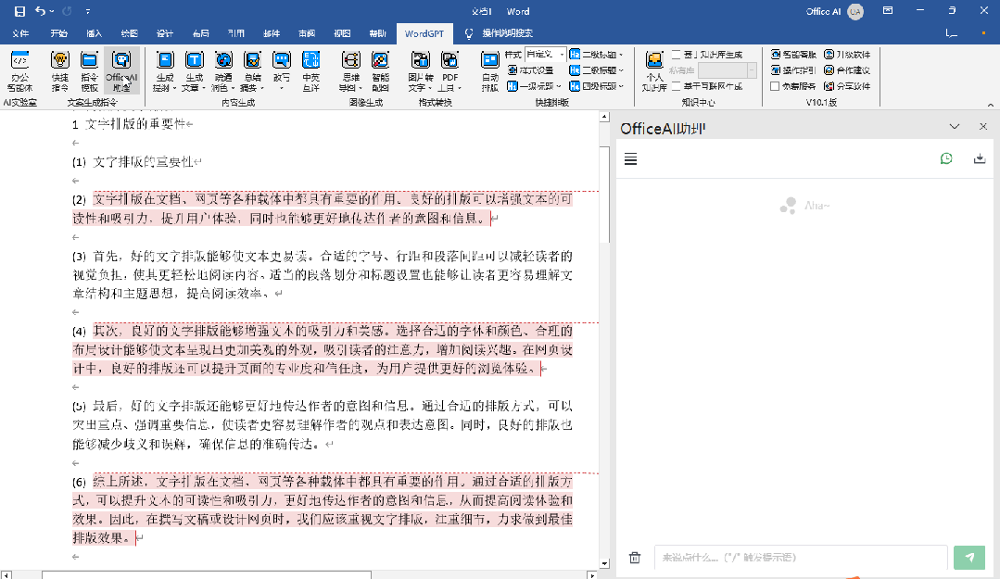
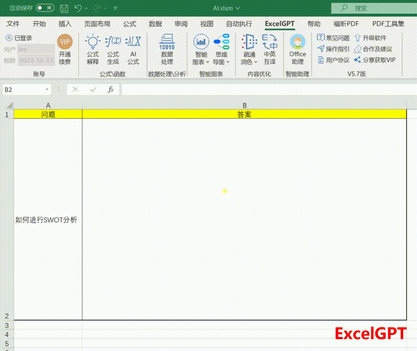
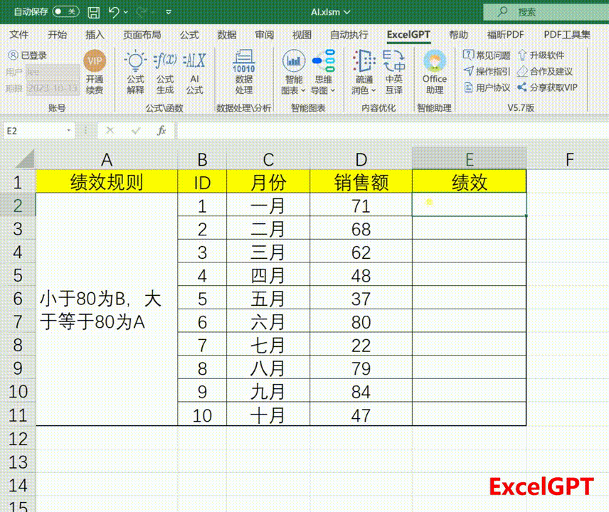
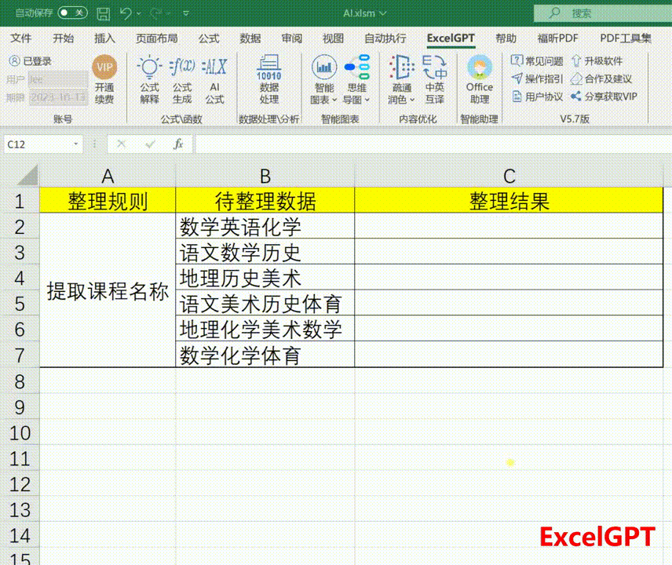

<div align="center">

# ExcelGPT

### 一站式 AI 智能表格处理插件

[](https://github.com/OfficeAIWork/ExcelGPT)
[](https://github.com/OfficeAIWork/ExcelGPT)
[](https://github.com/OfficeAIWork/ExcelGPT)

[下载软件](#-软件下载) · [功能介绍](#-软件使用) · [安装教程](#-软件安装) · [联系我们](#-联系我们)

---

</div>

## 软件简介

ExcelGPT 是一款智能表格处理插件，覆盖公式解释与生成、数据处理与图表、文本润色改写、中英文翻译、智能问答等全套表格处理功能，降低表格工作的学习成本与门槛，让您把时间精力集中在创造价值上。

| 核心能力 | 说明 |
| :--- | :--- |
| **公式解释与生成** | 自动解析公式含义与运算步骤，根据自然语言描述智能生成公式 |
| **数据处理与图表** | 根据需求描述生成或编辑数据，自动识别数据关系生成可视化图表 |
| **文本润色与翻译** | 疏通润色单元格文本、中英文互译，提升文案质量 |
| **AI 公式函数** | 内置 `AI.Ask`、`AI.Execute`、`AI.Extract` 三大公式，在单元格中直接调用 AI 能力 |
| **办公智能体** | 多模态智能助手，支持检索文件、生成图表/思维导图/图片、辅助编辑文档 |

> **适配环境：** Windows / macOS · Office 2012+ · WPS 最新版

---

## 软件安装

### 软件下载

| 平台 | 下载渠道 | 链接 |
| :--- | :--- | :--- |
| Windows | 123 云盘 | [下载地址 1](https://www.123pan.com/s/Czz1Td-glxxA.html) |
| Windows | 百度网盘 | [下载地址 2](https://pan.baidu.com/s/1iNtgi479sWEk0ZmUoibqTQ?pwd=NewB) |
| macOS | 官网 | [Mac 版下载](https://www.nbimgpt.com/Download/OfficeAI-Mac.html) |

> [!IMPORTANT]
> 安装前请关闭 Office、WPS 等相关软件；部分无管理员权限的电脑建议先临时关闭杀毒软件，安装完成后再开启。

### 安装步骤

1. 下载安装包并解压
2. 双击 `setup.exe`，按向导依次点击【下一步】完成安装
3. 安装完成后打开 Excel 或 WPS 即可使用

**启用 VBA 宏（必需）：**

打开 Excel → 【文件】→ 【选项】→ 【信任中心】→ 【信任中心设置】→ 【宏设置】→ 勾选「启用 VBA 宏」和「信任对 VBA 工程对象模型的访问」→ 【确定】


### 软件升级

点击【升级软件】按钮即可自动检查并更新到最新版本。如有新版本，等待下载完成后按向导步骤执行更新安装，完成后重新打开 Excel 或 WPS 即可。

| 升级菜单 | 升级界面 |
| :---: | :---: |
|  |  |

### 注册与使用

点击【登录】按钮进入注册页面，使用手机号注册后即可登录使用（全套 OfficeAI 账号通用）。


#### 版本对比

| 功能 | 免费版 | 基础版 / 专业版 | 企业版 |
| :--- | :---: | :---: | :---: |
| **生成质量** | 一般 | 高 | 高 |
| **内容生成** | 无限次 | 每日限额 | 无限次 |
| **OfficeAI 助理** | 永久免费 | 永久免费 | 永久免费 |
| **办公智能体** | ✓ | ✓ | ✓ |
| **自动排版** | ✓ | ✓ | ✓ |
| **思维导图** | ✗ | ✓ | ✓ |
| **图片生成** | ✗ | ✓ | ✓ |
| **适用人群** | 个人日常使用 | 所有人群，科研/办公 | 30 人以上企业 |
| **费用** | 免费 | 免费（超额按需付费） | 按需定制 |

> [!NOTE]
> - **免费版**：勾选右侧面板中「免费服务」即可不限量使用轻量版服务
> - **专业版**：所有功能无限使用 + 7×8 小时客服支持。关注公众号「OfficeAI办公」发送「邀请码」可获取优惠
> - **企业版**：支持私有化定制部署，详情联系客服
> - 如使用期限未同步更新，可关闭 Excel/WPS 后重新打开

---

## 软件使用

### 公式解释

自动解析当前选定单元格中公式的函数用途和运算步骤，帮助您轻松看懂公式。如果公式有误，会自动检查并给出正确公式建议，结果以批注形式备注在单元格中。


### 公式生成

根据问题或需求描述，自动在当前选中的单元格中生成对应公式。


### 数据处理

根据需求描述对数据进行生成或编辑处理，无需手动编写复杂公式。


### 生成图表

自动识别数据的关联关系，将选中的数据生成指定的图表形式。


### 思维导图

> [!WARNING]
> 仅支持 Excel，WPS 表格暂不支持

根据选定的单元格内容生成横向或纵向的思维导图。


### 疏通润色

选择需要改写的单元格，点击【疏通润色】，自动改写润色当前单元格文本内容。

### 中英互译

将选中单元格中的内容进行中英文转换。

### OfficeAI 助理

OfficeAI 助理是一个完全免费的智能对话机器人，擅长通过自然语言连续对话处理文本及数据，包括知识问答、语言翻译、生成各类文案、总结摘要、生成测试数据、数据分析等。遇到不会用的 Excel / WPS 功能，可以直接向助理提问。

> [!TIP]
> 助理会自动登录当前插件账号，如遇到无法登录的情况可手动登录。



### 便捷功能

- **聚光灯**：定位当前单元格的行列，方便查看
- **高亮相同**：高亮显示内容相同的单元格


### 办公智能体

办公智能体是适配各种工作场景的任务智能调度多模态智能体，可检索文件、生成图表/思维导图/图片/知识图谱，还能辅助编辑文档。智能体能力每月更新，建议定期通过【升级软件】获取最新能力。

**基本操作：**

- 命令行中输入 `/` 调用快捷指令
- 输入 `@` 调用知识库


### AI 公式

> [!WARNING]
> 仅支持 Excel，WPS 表格暂不支持

#### AI.Ask(prompt) — 提问公式

向 AI 提问并获取回答。

| 参数 | 说明 |
| :--- | :--- |
| `prompt` | 问题内容（文本或单元格引用） |

**调用方式：**

```
=AI.Ask("如何使用Excel制作工资表")    ← 传入文本
=AI.Ask(A1)                           ← 传入单元格
```



#### AI.Execute(content, operation) — 执行命令公式

对数据执行指定操作并返回处理结果。

| 参数 | 说明 |
| :--- | :--- |
| `content` | 需要处理的数据 |
| `operation` | 对数据执行的操作 |

**调用方式：**

```
=AI.Execute("广东", "省会")            ← 传入文本
=AI.Execute(A1, B1)                    ← 传入单元格
=AI.Execute("广东", B1)                ← 混合传入
=AI.Execute(A1, "省会")                ← 混合传入
```



#### AI.Extract(content, operation) — 内容提取公式

按规则从数据中提取信息，多个结果以分号 `;` 分隔。

| 参数 | 说明 |
| :--- | :--- |
| `content` | 需要处理的数据 |
| `operation` | 提取数据的规则 |

**调用方式：**

```
=AI.Extract("王总在珠江新城开会", "提取其中的地名")    ← 传入文本
=AI.Extract(A1, B1)                                   ← 传入单元格
=AI.Extract(A1, "提取其中的人名")                      ← 混合传入
```



### 帮助

| 功能 | 说明 |
| :--- | :--- |
| **智能客服** | 7×24 小时自助解决日常问题，未解决可点击【合作建议】联系我们 |
| **操作指引** | 打开软件操作说明书文档 |
| **合作建议** | 使用过程中有任何需求或建议欢迎反馈 |
| **分享软件** | 将 ExcelGPT 分享给好友 |


---

## 软件卸载

推荐通过控制面板卸载：控制面板 → 程序和功能 → 找到「OfficeAI 办公智能体」→ 右键【卸载】。


---

## 联系我们

微信联系：**WordGPT_KF**

<div align="center">


---

*如果这个项目对你有帮助，请给我们一个 Star 支持！*

</div>
